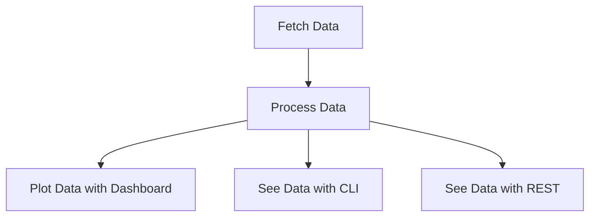

# What is Software Metrics Machine (SMM)?

Software Metrics Machine (SMM) is a local-first tool for understanding how software delivery works in practice. It
combines data from source control, pull requests, CI/CD, issue tracking, and code analysis so developers and tech leads
can investigate delivery flow, quality, collaboration, and technical debt from the same evidence.

SMM is designed to support team improvement, not individual surveillance. Metrics are signals for asking better questions;
they are not universal targets or a replacement for engineering judgment.

Inspired by [DORA](https://marabesi.com/2025/01/26/challenges-in-adopting-dora-metrics.html?utm_source=metrics-machine&utm_medium=documentation&utm_campaign=metrics&utm_id=metrics) and the [challenges that come with fetching, processing, and plotting](https://marabesi.com/2025/03/28/tracing-down-gitlab-metrics-with-python.html?utm_source=metrics-machine&utm_medium=documentation&utm_campaign=metrics&utm_id=metrics) software metrics, SMM aims
to provide a practical framework for collecting, analyzing, and visualizing the data that matters most to
development teams.

## The Problem with Story Points

Story points have long been used as a measure of progress in Agile software development. However, they often fail to capture the complexities of real-world software projects. Story points:

- Are subjective, vary between teams and individuals and is used as a management to always [wanting more](https://ronjeffries.com/articles/019-01ff/story-points/Index.html).
- Do not account for team dynamics, waiting times, or code quality.
- Provide limited insights into technical debt, code churn, or pipeline health.

These limitations can lead to misaligned priorities, inefficiencies, and a lack of actionable feedback for improving
team performance.

## How SMM helps

SMM addresses these challenges by offering a data-driven approach to software metrics. It collects and analyzes data from various sources, including:

- **Pipeline metrics**: Track success rates and execution times to find instability and slow feedback loops.
- **Change-request metrics**: Explore review time, throughput, comments, and merge patterns to identify collaboration bottlenecks.
- **Git-history metrics**: Analyze code churn, hotspots, coupling, and change frequency to guide technical-debt conversations.
- **Engineering health**: Bring delivery, quality, collaboration, and architecture signals into a leadership-oriented view.

The process is:

By focusing on these metrics, SMM enables teams to:

- Make informed decisions based on real data rather than subjective estimates.
- Identify and address inefficiencies in the development process.
- Foster a culture of continuous improvement and collaboration.

### Providers

To accomplish its mission, SMM uses a provider model where each provider extracts data from a specific source. Different
metrics come from different systems: coupling metrics, for example, are derived from Git history, while pipeline metrics
come from a provider API.

Other metrics, such as pipeline execution time and average change-request open time, come from provider APIs. Visit
[Supported providers](./supported-providers.md) for the metrics available from each integration.

## Why try SMM?

For new joiners and those unfamiliar with SMM, this project offers an opportunity to:

- Start with a repository you already know and validate the results locally.
- Replace one-off spreadsheet work with repeatable CLI and dashboard workflows.
- Give developers and tech leads a shared language for improvement experiments.

Whether you're a developer, a project manager, or simply someone passionate about improving software development practices,
SMM provides the tools and insights you need to succeed.
